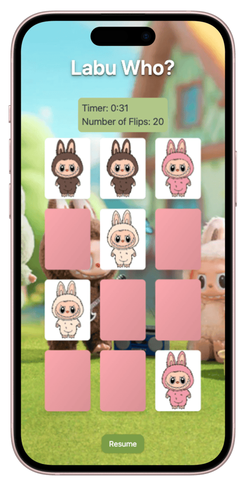
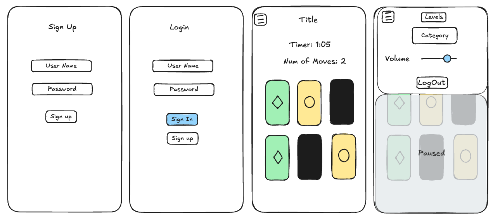
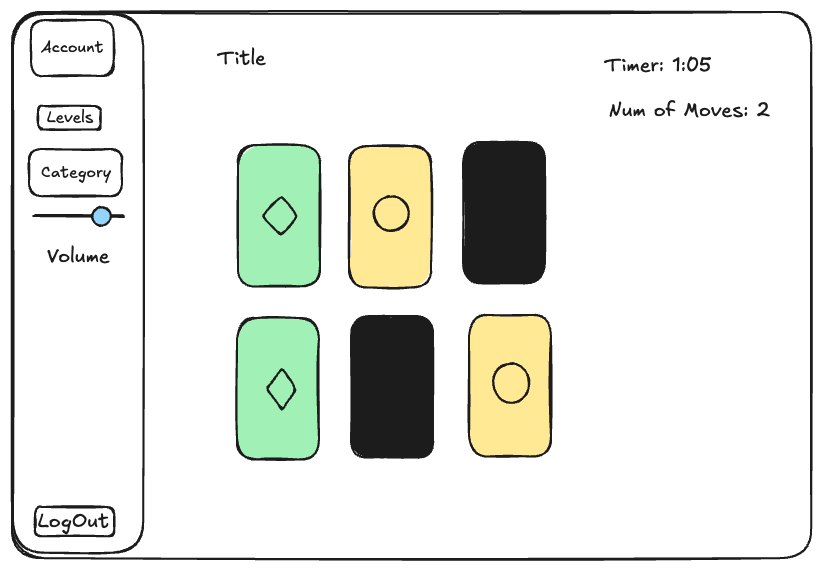
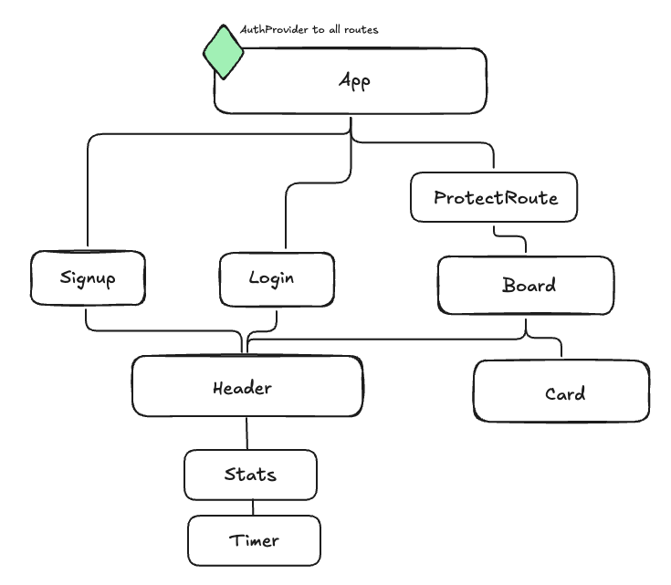
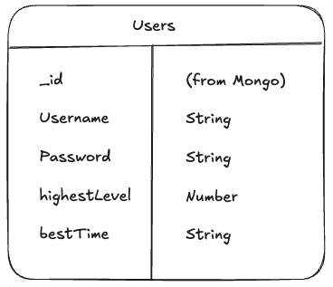

# Labubu



## User Story

A user with some free time wants a fun and quick mental warm-up to improve memory.

### Acceptance Criteria:

Users should be able to:

- Sign up to become a user
- Log in to the application to access the game
- Play the card matching game from start to completion
- Add their game stats to the database upon completion (including best time and highest level)

## Wireframes

#### Mobile



#### Desktop



#### Component Structure



#### User Schema



## Technologies Used

- React: the app uses embedded javascript to render information on the page
- React-Router: to couple URL segments to UI elements
- Node & Express: the app has its own server, built using Express
- MVC Pattern: the app uses the Model View Controller (MVC) programming design pattern
- MongoDB: the app persists data via a non-relational database for ease of application development and timing.
- Mongoose: to model and query data in MongoDB through Node
- Tailwind.css: The app is efficiently well-designed and considers user experience and usability
- JavaScript: the app has front-end interactivity
- [Axios](https://axios-http.com/docs/intro): the app uses isomorphic-fetch to make XMLHttpRequests from the browser and to make http requests from node.js (back-end)
- JSON Web Token: is used to create an authentication strategy for the app
- Bcrypt: the app uses bcrypt to encrypt user passwords
- Postman: to test server requests
- Vite: for a fast modern development environment

## Approach taken

1. Created project brief
2. Constructed wireframes to gain an understanding of the flow of the app.
3. Drew out schema for user database
4. Set up the team Trello board with a list of steps to completion for SCRUM
5. Created team Github Org for Github Flow workflow
6. Scaffolded project using Vite
7. Created and started local server
8. Created model, controller, and route architecture
9. Tested requests in PostMan
10. Created React components
11. Styled components using Tailwind.css

## Major Coding Win
Applying a limited number of images to any number of card pairs:
```js
const imgArr = ['A', 'B', 'C', 'D', 'E', 'F', 'G', 'H'];


const assignImgHelper = (imgArr, numArr) => {
    const uniqueNums = [...new Set(numArr)];
    const obj = {};

    for (let i = 0; i < uniqueNums.length; i++) {
      obj[uniqueNums[i]] = imgArr[i % imgArr.length];
    }
    return obj;
};

const startGame = (e) => {
    e.preventDefault();
    setGameStarted(true);
    const totalCards = gridSize * 2;
    const pairCount = Math.floor(totalCards / 2);
    const numbers = [...Array(pairCount).keys()].map((n) => n + 1);
    const shuffledCards = [...numbers, ...numbers]
      .sort(() => Math.random() - 0.5)
      .slice(0, totalCards);

    const imageAssign = assignImgHelper(imgArr, shuffledCards);
    const newShuffledCards = shuffledCards.map((number, index) => ({
      id: index,
      number,
      letter: imageAssign[number],
    }));
    setBoard(newShuffledCards);
  };
```

## Technical Challenges

- Michael
  - authentication logic
  - connecting backend and front end with authcontext
- Aaron
  - connecting front end and back end using routes
  - protecting routes and redirecting unauthorized users
- Lisa
  - game logic
  - Tailwind syntax
  - responsive mobile-first design

## Installation Instructions

1. Run `npm install` to install all necessary dependencies listed in the package.json
2. Create a `.env` file in the root. You'll need to have a `MONGO_URI` to connect to your MongoDB and a `JWT_SECRET` to create and validate user tokens (authentication).
3. To launch the app locally run `npm run dev` from the root folder and navigate to **localhost:5173** in your browser.

## Unsolved Problems

- a user can cheat the game by inspecting the page. If two cards have the same `cardImage` class, they are a match.

## Next Steps

- Style
  - style timer
  - add dark-mode styling
  - add back-of-card textured image
- Feature
  - add dropdown to choose board grid size
  - create a 404 page
  - create leaderboard page
  - add background music with volume controls
  - create the option for a two-player game

## Resources

- [Vite Dev Config](https://vite.dev/config/)
